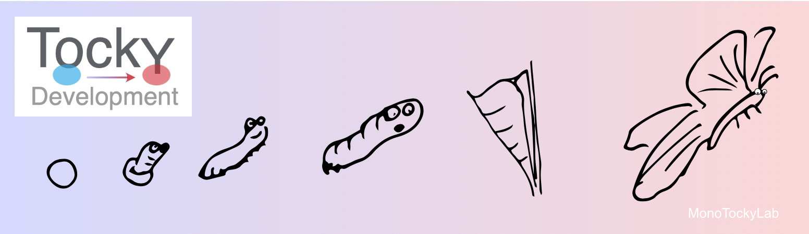
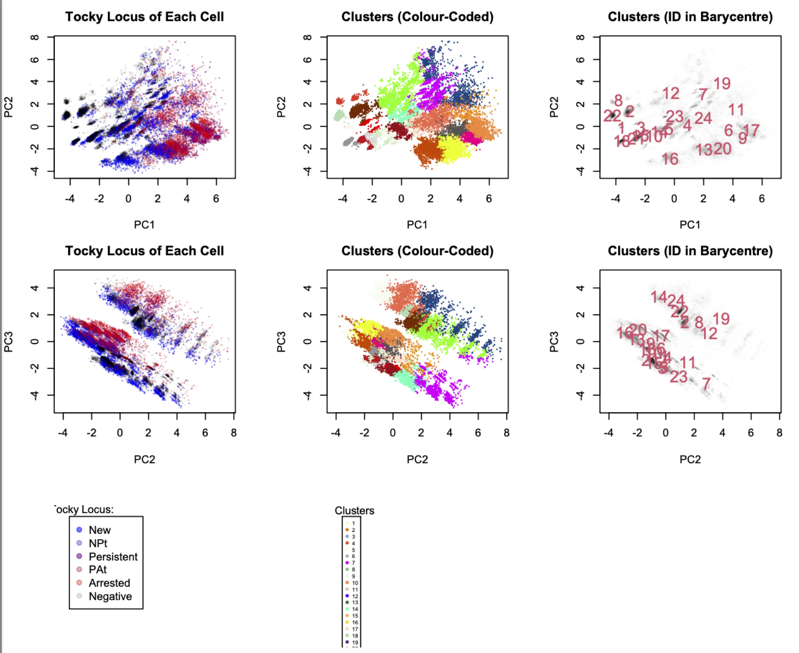
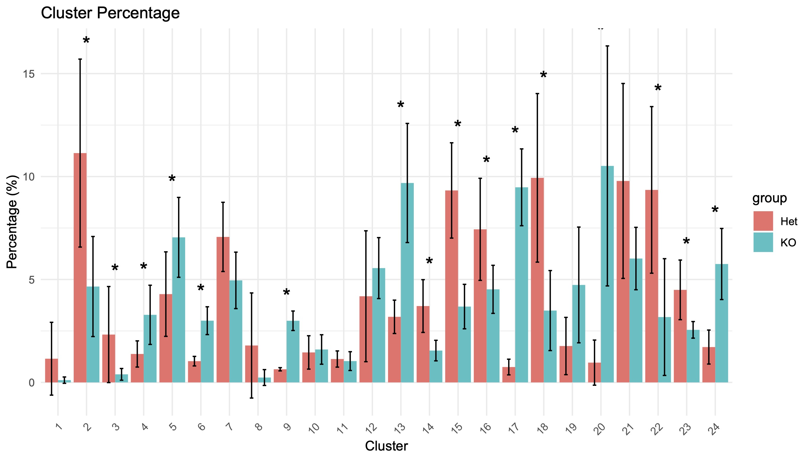
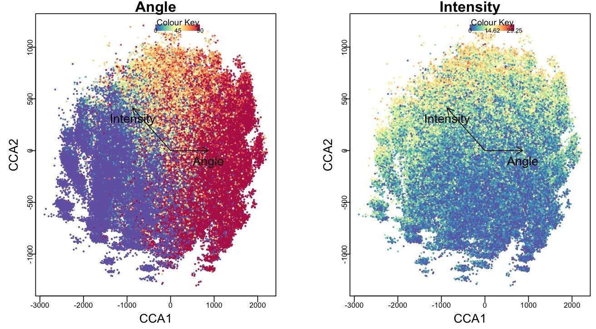
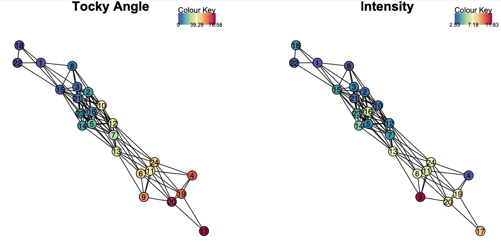
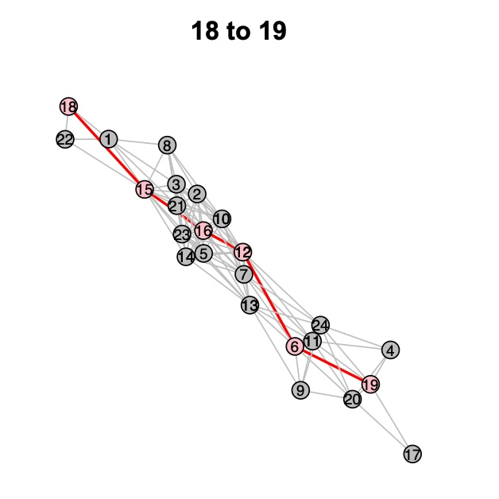
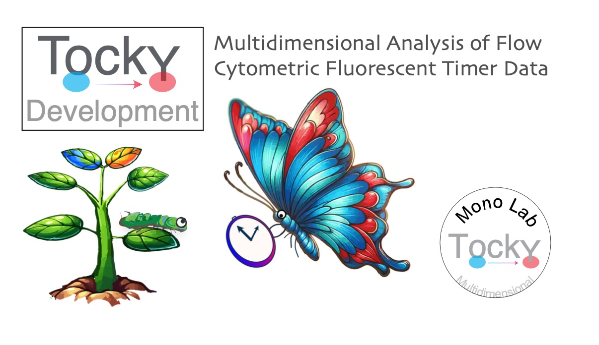

```{r, out.width = "80%", echo = FALSE}

```

## Introduction

The **TockyDevelopment** package (@Ono2024TockyDevelopment) provides an integrated workflow for studies in developmental cell biology and related areas, including thymus biology. It enables balanced analysis of multidimensional marker expression data (marker profiles) and Timer fluorescence, revealing temporal dynamics of developing cells and identifying temporal developmental trajectories in a data-oriented manner.

In this vignette, we will guide you through the key steps of the TockyDevelopment analysis pipeline:

1. Data Preprocessing
2. Precision PCA and Clustering
3. Cluster Feature Analysis and Group Statistics
4. Tocky Canonical Correspondence Analysis (Tocky-CCA)
5. Tocky Network Analysis
6. Dijkstra-Tocky Pathfinding

```{r, include = FALSE}
knitr::opts_chunk$set(
  collapse = TRUE,
  comment = "#>"
)
```

## 1. Data preprocessing

Follow manual pages for the TockyPrep package to [create a TockyPrepData object](https://monotockylab.github.io/TockyPrep/articles/TockyDataPreprocessing.html), performing necessary data preprocessing. In addition, use the GatingTree package to apply [`DefineNegatives` to determine the threshold values for markers to be analyzed](https://monotockylab.github.io/GatingTree/articles/DefineNegatives.html).

Read the following papers (@GatingTree2024, @TockyPrep2024) for the principles of TockyPrep and GatingTree.

```{r , eval = FALSE}
library(TockyPrep)
library(GatingTree)
library(TockyDevelopment)
```


For detailed preprocessing steps, refer to the [TockyPrep documentation](https://monotockylab.github.io/TockyPrep/articles/TockyDataPreprocessing.html).

## 2. Precision PCA and Clustering

### Performing PCA

Assuming that you have successfully produced TockyPrepData, use the `TockyPCA` function to perform Precision PCA:

```r
# Perform Precision PCA on the TockyPrepData object
x <- TockyPCA(x)
```

### Clustering Cells

Cluster the cells using `TockyClustering`:

```r
# Cluster cells into a desired number of clusters
x <- TockyClustering(x, num_centre = TRUE)
```

### Visualizing Clustering Results

```r
# Plot clusters in the PCA space
PlotTockyClustering(x)
```

```{r, out.width = "70%", echo = FALSE}

```

**Figure 1:** Clustering results displayed in the PCA space.

## 3. Cluster Feature Analysis and Group Statistics

Analyze cluster features and group statistics to understand the characteristics of each cluster.

### Visualizing Cluster Percentages

```r
# Plot the percentage of each cluster within the sample
PlotClusterPercentage(x)
```

```{r, out.width = "75%", echo = FALSE}

```

**Figure 2:** Percentage of cells in each cluster.

## 4. Tocky Canonical Correspondence Analysis

Perform Tocky-CCA to integrate marker profiles and Timer progression.

### Performing Tocky-CCA

```r
# Perform Tocky-CCA on the data
x <- TockyCCA(x)
```

### Visualizing Tocky-CCA Results

```r
# Generate a biplot of Tocky-CCA results
BiplotCCA(x)
```

```{r, out.width = "80%", echo = FALSE}

```

**Figure 3:** Biplot of Tocky-CCA results.

## 5. Tocky Network Analysis

Construct and visualize the Tocky network to analyze relationships between clusters.

### Constructing the Network

```r
# Construct the Tocky network
x <- TockyNetwork(x, cut_off = 0.2)
```

### Visualizing the Network

```r
# Plot the Tocky network
PlotTockyNetwork(x)
```

```{r, out.width = "80%", echo = FALSE}

```

**Figure 4:** Visualization of the Tocky network.

## 6. Dijkstra-Tocky Pathfinding

Identify developmental trajectories using the Dijkstra-Tocky Pathfinding algorithm.

### Finding Developmental Paths

```r
# Perform pathfinding between specified clusters
x <- DijkstraTockyPath(x, origin_node = '18', destination_node = '19')
```

```{r, out.width = "40%", echo = FALSE}

```

**Figure 5:** Identified developmental path from Cluster 18 to Cluster 19.

```{r, out.width = "80%", echo = FALSE}

```

```{r, out.width = "40%", echo = FALSE}
knitr::include_graphics('assets/MonoLab.jpg')
```


# References
